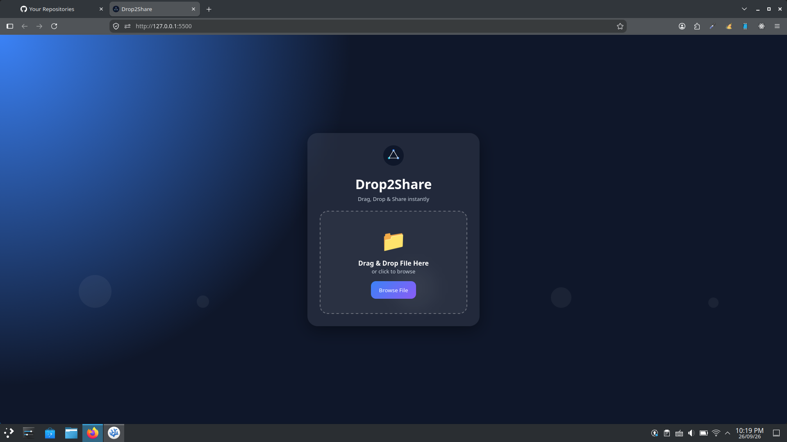
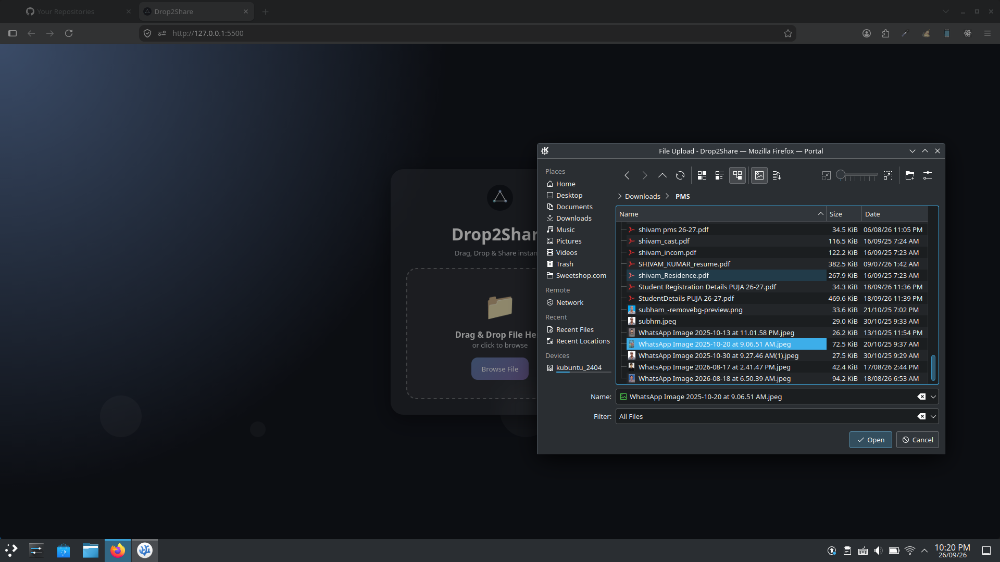
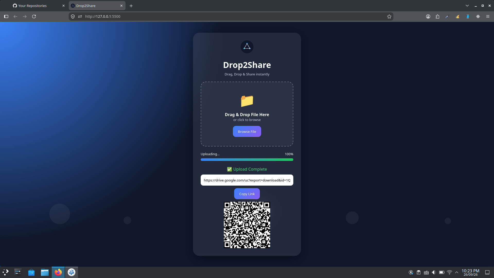

# Drop2Share 🚀📂

<p align="center">
  
</p>

<p align="center">
  <strong>Fast, Privacy-Focused File Sharing via Dynamic QR Codes and Temporary Direct Links.</strong>
</p>

<p align="center">
  
  
  
  
  
</p>

---

## 📌 Abstract & Overview

**Drop2Share** is a privacy-centric, web-based file sharing utility designed to enable frictionless data transfer without sacrificing user anonymity. In daily scenarios—such as printing documents at cyber cafes, sharing PDFs in colleges, or passing files to unfamiliar individuals—users often compromise private data like phone numbers, messaging accounts, or personal email addresses.

Drop2Share eliminates this exposure. Users can drag and drop any file format (images, documents, PDFs, audio, video, or folder archives) to instantly generate an encrypted Google Drive direct download link and an instant QR code. A recipient simply scans the QR code from their mobile screen to download the file directly, leaving zero personal traces behind. For enhanced security and privacy protection, shared links automatically expire and deactivate within **3 days**, ensuring transferred assets cannot be retained or misused.

---

## ✨ Key Features

- 🛡️ **Zero Personal Information Footprint**: Share files without revealing personal phone numbers, social accounts, or personal email IDs.
- ⚡ **Instant Drag-and-Drop Uploader**: Clean glassmorphic dropzone with immediate file selection and visual progress tracking.
- 📱 **Instant QR Code Generation**: Converts file transfer links into scannable on-screen QR codes for swift cross-device transfers.
- ⏳ **Automated 3-Day Auto-Expiry**: Shared download links automatically invalidate after 3 days to prevent unauthorized long-term access.
- ☁️ **Cloud Storage Integration**: Leverages Google Drive infrastructure for dependable storage and high-speed delivery.
- 📊 **Activity & Log Monitoring**: Integrated Google Sheets automation to maintain audit logs and monitor active distribution securely.
- 🎨 **Minimalist Glassmorphic UI**: High-contrast, dark-themed responsive layout with smooth CSS micro-animations.

---

## 📸 Application Screenshots

<div align="center">
  <h3>1. Home / File Dropzone</h3>
  
  <br/><br/>
  
  <h3>2. File Selection & Uploading</h3>
  
  <br/><br/>

  <h3>3. Generated QR Code & Direct Link</h3>
  
</div>

---

## 🛠️ Tech Stack & Architecture

- **User Interface**: Semantic HTML5, CSS3 (Modern Glassmorphism & Custom Flexbox Layouts)
- **Client Logic**: Vanilla JavaScript (ES6+, DOM Manipulation, QR Code generation libraries)
- **File Storage**: Google Drive API / Cloud Integration
- **Monitoring & Logs**: Google Sheets Integration / App Script Automation

---

## 📂 Project Structure

```text
Drop2Share/
├── images/
│   ├── home.png         # Main dropzone preview
│   ├── upload.png       # File selection dialog preview
│   └── QR_Link.png      # Generated QR and direct download link preview
├── drop2share.svg       # Brand vector logo
├── index.html           # Core HTML structure & interface
├── script.js            # Upload handler, Drive integration & QR generation logic
├── style.css            # Dark glassmorphic styling & responsive layouts
└── README.md            # Project documentation

```

---

## ⚙️ Getting Started & Local Setup

### 1. Clone the Repository

```bash
git clone https://github.com/Shivam16a/Drop2share.git
cd Drop2share

```

### 2. Run Locally

Because Drop2Share is built using modern vanilla web technologies, no heavy build pipelines or npm installations are necessary:

* **Option A (VS Code Live Server)**: Right-click `index.html` inside VS Code and select **"Open with Live Server"**.
* **Option B (Python Local Server)**:


* **Option C (Direct Browser Launch)**: Open `index.html` directly in any modern browser (Chrome, Firefox, Edge, Brave).

---

## 🔒 Security & Privacy Workflow

```text
[User selects File] 
       │
       ▼
[Uploaded to Google Drive via Secure Script]
       │
       ▼
[Log recorded in Google Sheets Database]
       │
       ▼
[Encrypted URL converted to QR Code + Copy Link]
       │
       ▼
[Recipient Scans QR & Downloads File]
       │
       ▼
[Link Automatically Deactivates After 3 Days]

```

---

## 👤 Author

* **GitHub**: [@Shivam16a](https://www.google.com/search?q=https://github.com/Shivam16a&utm_source=gemini)
* **Repository**: [https://github.com/Shivam16a/Drop2share](https://github.com/Shivam16a/Drop2share?utm_source=gemini)